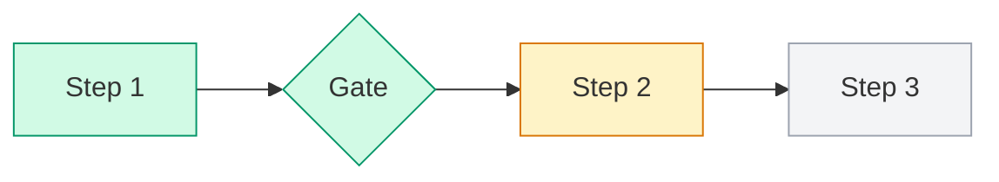

# FLOW.md: the live flow of a run

The orchestrator (main session) owns FLOW.md. Subagents never write it. It is for the user to read, so keep it plain and current.

## Where
| Orchestrator | File |
|---|---|
| `/flow:*` | `docs/features/<slug>/FLOW.md` |
| `/quick:*` | `docs/features/<slug>/FLOW.md` |
| `/court:trial` | `docs/court/<slug>-<yyyyMMdd-HHmm>/FLOW.md` |
| `/factory:*` | `~/.claude/factory/runs/<yyyyMMdd-HHmm>-<slug>/FLOW.md` |

## When to update (Edit, never rewrite the whole file)
- Run starts: create it from the template.
- A step starts or ends, a gate is decided, the user changes something, the run pauses, resumes, stops or finishes: update `Status`/`Now`/`Next`, the step's class in the map, and add one Timeline row.
- If the folder already uses `activity.log`, still write that line too; FLOW.md is the readable view, not a replacement.

## Template
````markdown
# Flow: <run title>
**Orchestrator:** /<command> · **Started:** <yyyy-MM-dd HH:mm> · **Options:** <mode, scope, design… or none>
**Status:** running | waiting for you | paused | done | stopped
**Now:** <current step> · **Next:** <next step or "—">

## Map


## Timeline
| # | Time | Step | Who | Result | Files |
|---|---|---|---|---|---|
| 1 | HH:mm | <step> | <agent or user> | <one line> | <links or —> |

## Decisions
| Gate | Decision | By | Note |
|---|---|---|---|
````

## Map per orchestrator (use these nodes; skip ones that don't apply and mark them n/a in Options)
- **/flow**: Design → {G0} → Analyze → {G1} → Breakdown → {G2} → Finalize → {G3} → Build (one node per section when Scope is per-section) → QA → Release decision
- **/quick**: Plan → {Plan gate} → Build → Check → Done
- **/court:trial**: Intake → Case File → Round 1 attack → Round 1 defense → … → Verdict
- **/factory**: Intake → Search (local / Anthropic / GitHub) → Security review → Proposal → {Approval} → Build → Registry

## Rules
- One Timeline row per event, one line each. Link files; don't paste their content.
- A failed or rejected step gets `failed` and a Timeline row saying why.
- Never put secrets, tokens or env values in FLOW.md.
