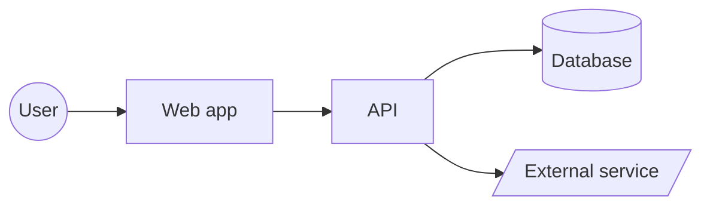

# Notes page templates

Copy the skeleton, fill it from the code, and delete hint lines (in `<…>`).

## README.md
````markdown
# <System name>: Notes

> **TL;DR:** <what it does, for whom, in 2-3 lines>. Built with <stack>. Runs on <hosting>.


Read it as: <one sentence>.

## Start here
| If you want to… | Read |
|---|---|
| Understand what the system is | [01-overview](01-overview.md) |
| Run it or change settings | [02-configuration](02-configuration.md) |
| See what happens when a user does X | [03-system-flow](03-system-flow.md) |
| Follow the data | [04-data-flow](04-data-flow.md) |
| See the database | [05-database-schema](05-database-schema.md) |
| Look up a term | [06-glossary](06-glossary.md) |

## Key facts
- <5-8 bullets: main modules, auth method, database, external services, deploy target>

## Open questions
- <things the code didn't answer, or "None">

---
Sources: <…>
Last updated: <date> (commit <sha>)
````

## 01-overview.md
TL;DR → component flowchart → **Parts** table (`Part | Path | Does | Talks to`) → **Tech stack** table (`Layer | Tech | Version`) → **Key decisions** bullets (only those visible in code/config).

## 02-configuration.md
TL;DR → **Run locally** (numbered steps, real script names) → **Environment variables** table:
`Name | Purpose | Required | Default | Read in` (no values) → **Config files** table (`File | Controls`) → **Ports & URLs** → **Scripts** (`Script | What it does`) → **Deploy** (target, build command, env per environment).

## 03-system-flow.md
TL;DR (list the journeys) → per journey: `### <Journey>`, one-line goal, `sequenceDiagram`, "Read it as", then numbered steps with file links, then **Errors** bullets.

## 04-data-flow.md
TL;DR → overall `flowchart LR` (sources → validation → services → stores → outputs) → **Data stores** table (`Store | Kind | Holds | Written by | Read by`) → **Inbound** and **Outbound** tables (`Source/Target | Format | Trigger | Handler`) → **Sensitive data** bullets (PII, payments, tokens: where they go and how they're protected).

## 05-database-schema.md
TL;DR (DB engine, count of tables, core entities) → `erDiagram` (core tables; split by domain if > 12) → per table: `### <table>` one-line purpose + table `Column | Type | Key | Null | Notes` → **Indexes & constraints** → **Migrations** (where, how to run) → **Model vs migration differences** if any.

## 06-glossary.md
Alphabetical table `Term | Meaning | Where in code`.
